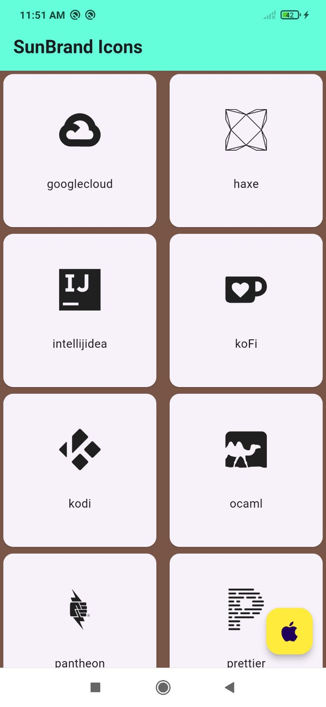

sunicons is a package for Flutter developers that provides a collection of attractive icons from 
different packs. Developers can use this package to quickly and easily find and add icons to their apps. 
sunicons gives developers access to a variety of design elements that can make their apps look more appealing 
and modern. Developers can also choose from many popular icon packs to suit their preferences and needs.


## Features

The best brand icons are often simple and easy to understand.
A Flutter package for sun Icons, which provides over  Free  icons for popular brands.
1. Customizable Icons
2. Icon Library
3. Most Beautiful Icons


## Installation
Add the latest version of package to your pubspec.yaml (and run 'dart pub get') yaml dependancies: sunicons: ^0.0.2

Import the package and use it in your Flutter app. import 'package:sunicons/sunicons.dart';


## Getting started


```dart
import "package:flutter/material.dart";
import 'package:sunicons/sunicons.dart';

import './icons_list.dart';

void main() => runApp(const MyApp());

class MyApp extends StatelessWidget {
  const MyApp({super.key});

  Widget iconCard(IconData iconData, String iconName) {
    return Card(
      child: Column(
        mainAxisAlignment: MainAxisAlignment.center,
        children: <Widget>[
          Icon(
            iconData,
            size: 50.0,
          ),
          const SizedBox(height: 30.0),
          Text(iconName)
        ],
      ),
    );
  }

  @override
  Widget build(BuildContext context) {
    return MaterialApp(
      debugShowCheckedModeBanner: false,
      title: "Sun Brand Icons Example",
      home: Scaffold(
        backgroundColor: Colors.brown,
        appBar: AppBar(
          title: const Text('SunBrand Icons', style: TextStyle(
            fontWeight: FontWeight.bold,
          ),),

          backgroundColor: Colors.red,
        ),
        body: GridView.builder(
          gridDelegate: const SliverGridDelegateWithFixedCrossAxisCount(
            crossAxisCount: 2,
            crossAxisSpacing: 8.0,
          ),
          itemBuilder: (BuildContext context, int index) {
            return iconCard(
              iconDataList[index],
              iconNameList[index],
            );
          },
          itemCount: iconDataList.length,
        ),
        floatingActionButton: FloatingActionButton(
          onPressed: () {

          },
          backgroundColor: Colors.yellow,
          child: const Icon(SunBrandIcons.apple),
        ),
      ),
    );
  }
}


```


## Screenshot


